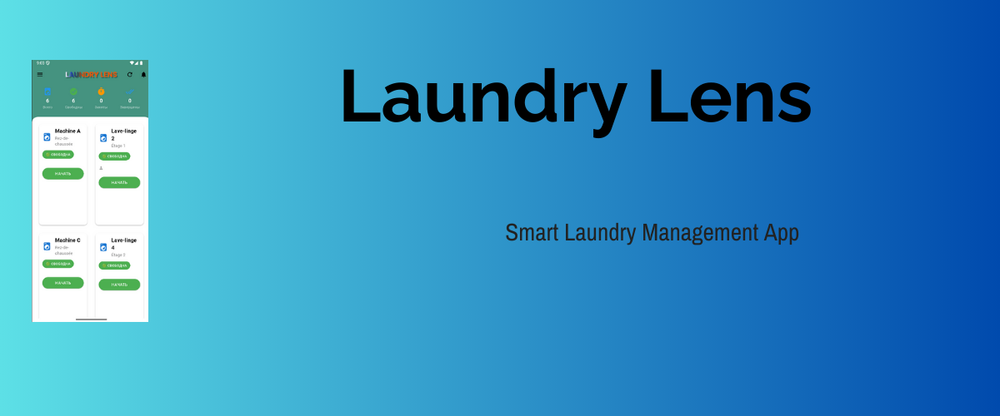

<p align="center">
  
</p>

# 🧺 Laundry Lens
### Smart Laundry Management App for Dormitories

<p align="center">
  
  
  
  
</p>

---

# 🌐 README Languages
- 🇬🇧 [English](#english-version)
- 🇫🇷 [Français](#version-française)
- 🇷🇺 [Русский](#русская-версия)

---

# 🇬🇧 English Version

## 👤 Founder
**Ramzeen Chirio BARBOZA**

## 📌 App Description
Laundry Lens is a smart mobile application that helps dormitory residents track washing machine availability, receive notifications, and manage laundry activity in real time.

## ✨ Features
- 🔄 Real-time machine status  
- 📷 Machine recognition  
- 🔔 Push notifications  
- 🌍 Multilingual interface   
- 🧼 Modern & clean UI  
- 📊 Statistics (coming soon)  
- 🔑 Admin dashboard (coming soon)

## 🏗 Tech Stack
- Flutter  
- Dart  
- Firebase (Auth, Firestore, Storage,messaging)  
- Provider  
- Clean Architecture  

## 🖼 Screenshots  
*(Add your images here — recommended size 400–600px each)*  
<p align="center">
  
  
  
</p>

## 🚀 Installation
```bash
git clone https://github.com/ramzeen99/laundry_lens.git
cd laundry-lens
flutter pub get
flutter run
````

## 📂 Project Structure

```
lib/
 ├── model/
 ├── services/
 ├── providers/
 ├── pages/
 ├── data/
 └── components/
```

## 🛣 Roadmap

* [x] Real-time tracking
* [x] Multilingual support
* [ ] QR Machine Scanning
* [ ] Usage Statistics
* [ ] Admin Mode

## 🤝 Contribute

Pull requests are welcome.

## 📄 License

MIT License.

---

# 🇫🇷 Version Française

## 👤 Fondateur

**Ramzeen Chirio BARBOZA**

## 📌 Description de l'application

Laundry Lens est une application intelligente permettant aux résidents de dortoirs de suivre l’utilisation des machines à laver, recevoir des notifications et gérer leur activité de lessive.

## ✨ Fonctionnalités

* 🔄 Suivi en temps réel
* 📷 Identification de machine
* 🔔 Notifications push
* 🌍 Interface multilingue (FR / EN / RU)
* 🧼 Interface moderne
* 📊 Statistiques (bientôt)
* 🔑 Mode administrateur (bientôt)

## 🖼 Captures d’écran

*(Ajoutez vos images ici — taille recommandée 400–600px)*

<p align="center">
  
  
  
</p>

## 🚀 Installation

```bash
git clone https://github.com/ramzeen99/laundry_lens.git
cd laundry-lens
flutter pub get
flutter run
```

## 📂 Structure du projet

```
lib/
 ├── model/
 ├── services/
 ├── providers/
 ├── pages/
 ├── components/
 └── data/
```

## 🛣 Feuille de route

* [x] Fonctionnalités principales
* [x] Support multilingue
* [ ] Scan QR
* [ ] Statistiques
* [ ] Mode Administrateur

## 🤝 Contribuer

Les contributions sont les bienvenues.

## 📄 Licence

Licence MIT.

---

# 🇷🇺 Русская версия

## 👤 Основатель

**Ramzeen Chirio BARBOZA**

## 📌 Описание приложения

Laundry Lens — это умное приложение для мониторинга стиральных машин в общежитиях, получения уведомлений и управления процессом стирки.

## ✨ Возможности

* 🔄 Статус машин в реальном времени
* 📷 Идентификация машины
* 🔔 Push-уведомления
* 🌍 Многоязычный интерфейс (RU / EN / FR)
* 🧼 Современный интерфейс
* 📊 Статистика (скоро)
* 🔑 Админ-панель (скоро)

## 🖼 Скриншоты

*(Добавьте свои изображения — рекомендуется 400–600px)*

<p align="center">
  
  
  
</p>

## 🚀 Установка

```bash
git clone https://github.com/ramzeen99/laundry_lens.git
cd laundry-lens
flutter pub get
flutter run
```

## 📂 Структура проекта

```
lib/
 ├── models/
 ├── services/
 ├── providers/
 ├── pages/
 ├── components/
 └── data/
```

## 🛣 План разработки

* [x] Основные функции
* [x] Поддержка языков
* [ ] QR-сканирование
* [ ] Статистика
* [ ] Админ-панель

## 🤝 Участие

Pull Request’ы приветствуются.

## 📄 Лицензия

MIT License.


# 📥 Downloads (Coming Soon)

<p align="center">
  <!-- Google Play badge placeholder -->
  

  <!-- App Store badge placeholder -->
  
</p>

> 🚧 **Download section reserved** — Badges will be added once the app is published.


# 🎨 Improved Banner Design (Reserved)

<p align="center">
  <!-- Replace this later with a more modern and redesigned banner -->
  
</p>

> 🎨 **Design placeholder** — A more elegant, modern banner will be added here later  
(gradient, mascot icon, app mockups, etc.)

---

# 🔧 How It Works (Reserved)

Below is the reserved multilingual structure for the *How it Works* section.

---

## 🇬🇧 How It Works (Coming Soon)

> **This section will explain step-by-step how the app works**, including:
> - How to check machine availability  
> - How to book or mark a machine  
> - How notifications work  
> - How users authenticate  
> - How the dorm system structure works  

---

## 🇫🇷 Comment ça marche (Bientôt)

> **Cette section expliquera étape par étape le fonctionnement de l’application**, incluant :  
> - Comment vérifier la disponibilité  
> - Comment marquer une machine comme utilisée  
> - Comment fonctionnent les notifications  
> - Comment les résidents s’authentifient  
> - Comment fonctionne la gestion du dortoir  

---

## 🇷🇺 Как это работает (Скоро)

> **В этом разделе будет подробно объяснена работа приложения**, включая:  
> - Как проверять доступность машин  
> - Как отмечать машину как занятую  
> - Как работают уведомления  
> - Как проходит авторизация пользователя  
> - Как работает система общежития  


